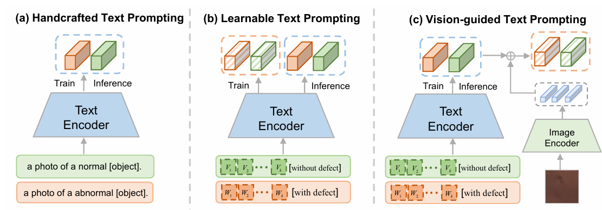
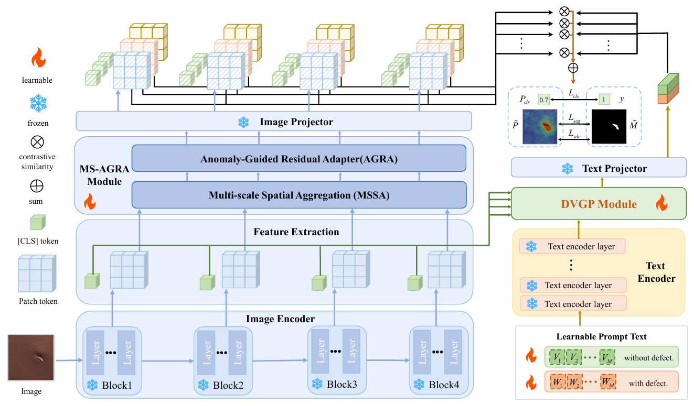
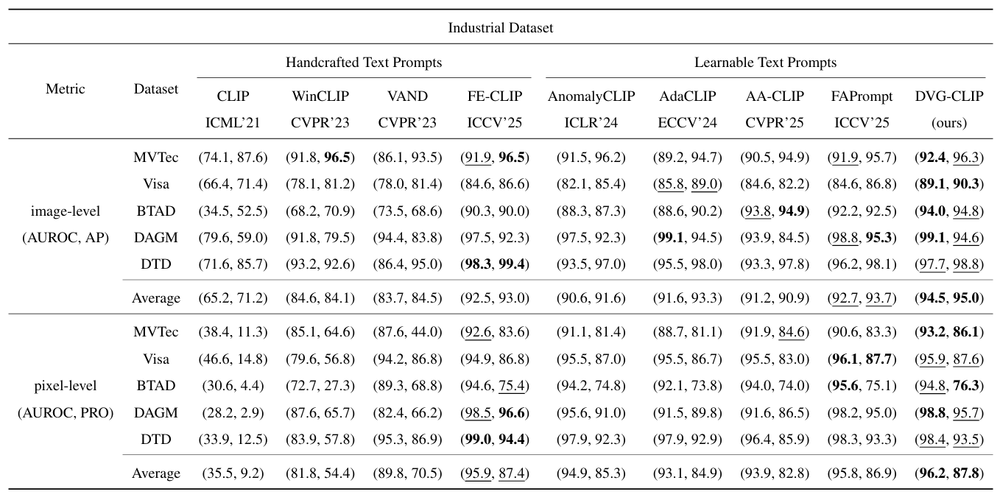
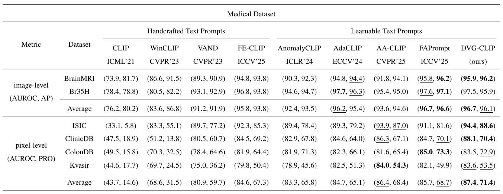
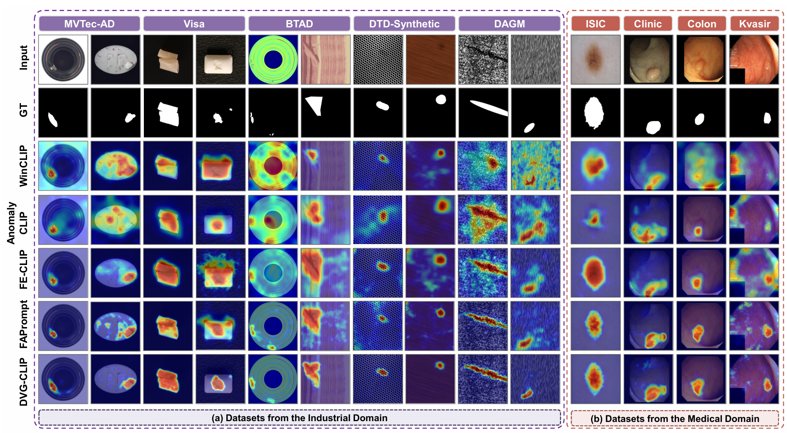

<div align="center">
<h3>DVG-CLIP: Dynamic Vision-Guided Dual-Modal Enhancement for Zero-Shot Anomaly Detection</h3>


Liyang Dai<sup>1</sup>, Ruisheng Jia<sup>1</sup>, Xiao Yan<sup>1</sup>, Hongmei Sun<sup>1</sup>

<sup>1</sup>College of Computer Science and Engineering, Shandong University of Science and Technology, Qingdao 266590, China


[[`Paper`]()] 
[[`Project Page`](https://github.com/DLYLab/DVG-CLIP)]


</div>

**The model is coming soon**
## Abstract
Zero-shot anomaly detection is of paramount importance in data-scarce industrial and medical scenarios. However, exist
ing CLIP-based approaches suffer from a critical “dual mismatch” problem: static or learnable text prompts lack image
specificity, resulting in cross-modal semantic misalignment; and the CLIP visual encoder, pre-trained exclusively on nat
ural images, is biased toward global semantics and struggles to capture multi-scale fine-grained defects, thereby inducing
visual representation mismatch. To alleviate these dual mismatches, we proposes DVG-CLIP, a novel dynamic adaptation
framework built upon a triple synergistic mechanism “visual guidance, multi-scale enhancement, discriminative contrast.”
First, we design a dynamic visual-guided text generation module that modulates text embeddings with multi-layer global
visual features, achieving precise text-to-visual content adaptation. Second, we introduce a multi-scale anomaly-guided
residual adapter that integrates spatial aggregation and residual self-attention to markedly enhance perception of local
anomalies. Finally, we incorporate a visual discriminative contrastive loss that explicitly enlarges the feature distance
between normal and anomalous samples, thereby improving discriminative robustness. Extensive experiments on five in
dustrial and six medical datasets demonstrate that DVG-CLIP significantly outperforms state-of-the-art zero-shot methods
in both anomaly detection and localization performance.

## Overview
<p align="center">
  
</p>
<p align="center">Comparison of hand-crafted text prompts, learnable text prompts, and our vision-guided dynamic text prompts. Hand-crafted prompts are fixed and unchanged throughout both training and inference; learnable prompts are dynamically optimized during training but revert to static templates at inference; our approach dynamically generates targeted prompt text adapted to the input image during inference, thereby strengthening the guidance ability from the text modality.</p>
<p align="center">
  
</p>
<p align="center">Overall architecture of the proposed DVG-CLIP framework.</p>


---

## 🛠️ Getting Started

### Installation
- Prepare the DVG-CLIP extra environment
  ```
    pip install torch==2.2.1 torchvision==0.17.1 torchaudio==2.2.1 --index-url https://download.pytorch.org/whl/cu121
  ```

## 📜 Main results

<p align="center">

  
  
</p>

## 📜 visualization

<p align="center">
  
</p>

## Citation
If you find this code useful, don't forget to star the repo and cite the paper:
```

```
## Acknowledgements
We thank the great works [AnomalyCLIP](https://github.com/zqhang/AnomalyCLIP) for providing assistance for our research.